# Partie 6 — Diagrammes UML & Architecture

> Diagrammes de séquence, états, activité, architecture C4
> Mermaid syntax (rendu dans la plupart des viewers Markdown)

---

## 1. DIAGRAMMES DE SÉQUENCE — Flux critiques

### 1.1 Séquence : Diagnostic IA complet

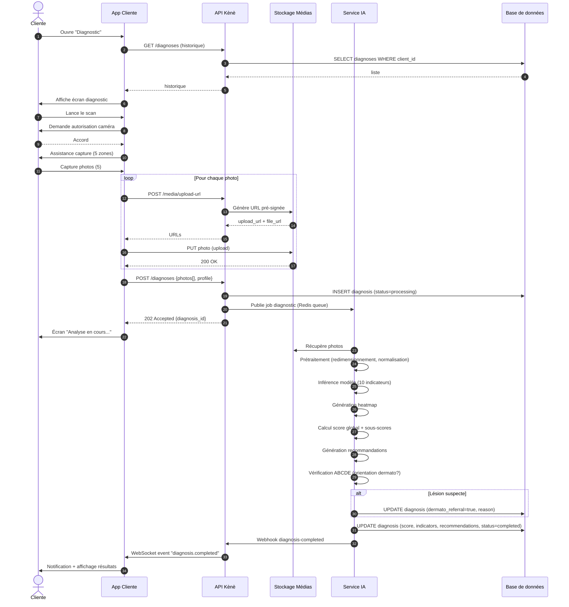
```mermaid
sequenceDiagram
    autonumber
    actor C as Cliente
    participant App as App Cliente
    participant API as API Kènè
    participant S3 as Stockage Médias
    participant IA as Service IA
    participant DB as Base de données

    C->>App: Ouvre "Diagnostic"
    App->>API: GET /diagnoses (historique)
    API->>DB: SELECT diagnoses WHERE client_id
    DB-->>API: liste
    API-->>App: historique
    App->>C: Affiche écran diagnostic

    C->>App: Lance le scan
    App->>C: Demande autorisation caméra
    C-->>App: Accord
    App->>C: Assistance capture (5 zones)
    C->>App: Capture photos (5)

    loop Pour chaque photo
        App->>API: POST /media/upload-url
        API->>S3: Génère URL pré-signée
        S3-->>API: upload_url + file_url
        API-->>App: URLs
        App->>S3: PUT photo (upload)
        S3-->>App: 200 OK
    end

    App->>API: POST /diagnoses {photos[], profile}
    API->>DB: INSERT diagnosis (status=processing)
    API->>IA: Publie job diagnostic (Redis queue)
    API-->>App: 202 Accepted {diagnosis_id}

    App->>C: Écran "Analyse en cours..."

    IA->>S3: Récupère photos
    IA->>IA: Prétraitement (redimensionnement, normalisation)
    IA->>IA: Inférence modèle (10 indicateurs)
    IA->>IA: Génération heatmap
    IA->>IA: Calcul score global + sous-scores
    IA->>IA: Génération recommandations
    IA->>IA: Vérification ABCDE (orientation dermato?)

    alt Lésion suspecte
        IA->>DB: UPDATE diagnosis (dermato_referral=true, reason)
    end

    IA->>DB: UPDATE diagnosis (score, indicators, recommendations, status=completed)
    IA->>API: Webhook diagnosis-completed
    API->>App: WebSocket event "diagnosis.completed"
    App->>C: Notification + affichage résultats
```

### 1.2 Séquence : Réservation RDV avec acompte Mobile Money

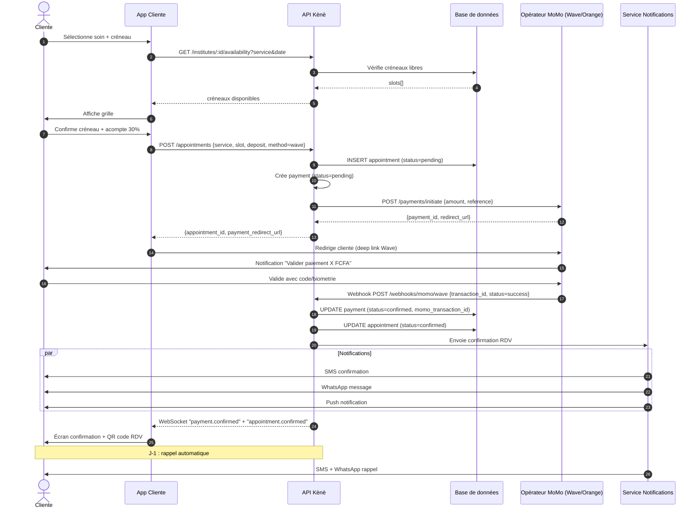
```mermaid
sequenceDiagram
    autonumber
    actor C as Cliente
    participant App as App Cliente
    participant API as API Kènè
    participant DB as Base de données
    participant MoMo as Opérateur MoMo (Wave/Orange)
    participant Notif as Service Notifications

    C->>App: Sélectionne soin + créneau
    App->>API: GET /institutes/:id/availability?service&date
    API->>DB: Vérifie créneaux libres
    DB-->>API: slots[]
    API-->>App: créneaux disponibles
    App->>C: Affiche grille

    C->>App: Confirme créneau + acompte 30%
    App->>API: POST /appointments {service, slot, deposit, method=wave}
    API->>DB: INSERT appointment (status=pending)
    API->>API: Crée payment (status=pending)
    API->>MoMo: POST /payments/initiate {amount, reference}
    MoMo-->>API: {payment_id, redirect_url}
    API-->>App: {appointment_id, payment_redirect_url}

    App->>MoMo: Redirige cliente (deep link Wave)
    MoMo->>C: Notification "Valider paiement X FCFA"
    C->>MoMo: Valide avec code/biometrie
    MoMo->>API: Webhook POST /webhooks/momo/wave {transaction_id, status=success}
    API->>DB: UPDATE payment (status=confirmed, momo_transaction_id)
    API->>DB: UPDATE appointment (status=confirmed)
    API->>Notif: Envoie confirmation RDV

    par Notifications
        Notif->>C: SMS confirmation
        Notif->>C: WhatsApp message
        Notif->>C: Push notification
    end

    API-->>App: WebSocket "payment.confirmed" + "appointment.confirmed"
    App->>C: Écran confirmation + QR code RDV

    Note over C,API: J-1 : rappel automatique
    Notif->>C: SMS + WhatsApp rappel
```

### 1.3 Séquence : Encaissement caisse (vente + paiement multi-MoMo)

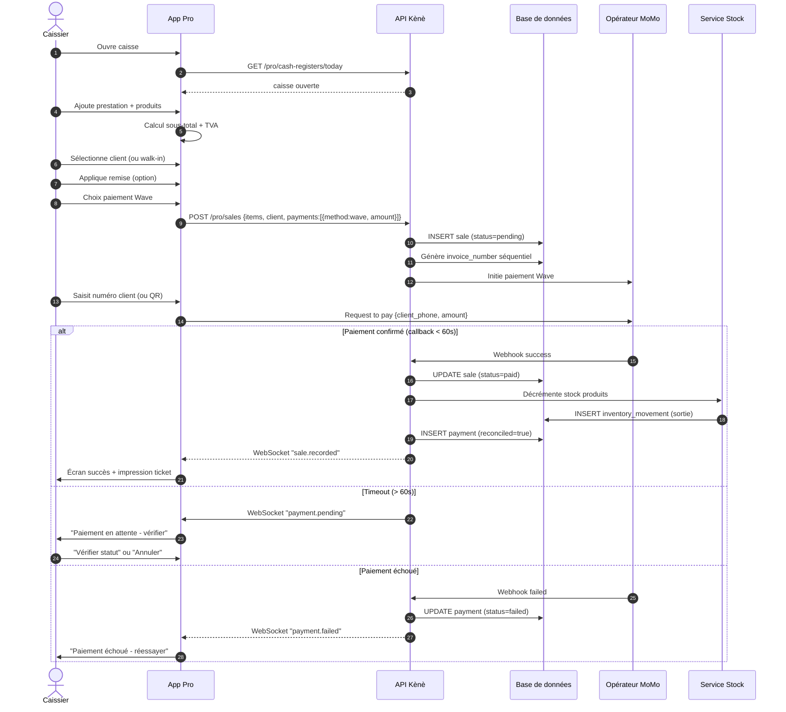
```mermaid
sequenceDiagram
    autonumber
    actor Ca as Caissier
    participant Pro as App Pro
    participant API as API Kènè
    participant DB as Base de données
    participant MoMo as Opérateur MoMo
    participant St as Service Stock

    Ca->>Pro: Ouvre caisse
    Pro->>API: GET /pro/cash-registers/today
    API-->>Pro: caisse ouverte

    Ca->>Pro: Ajoute prestation + produits
    Pro->>Pro: Calcul sous-total + TVA
    Ca->>Pro: Sélectionne client (ou walk-in)
    Ca->>Pro: Applique remise (option)
    Ca->>Pro: Choix paiement Wave

    Pro->>API: POST /pro/sales {items, client, payments:[{method:wave, amount}]}
    API->>DB: INSERT sale (status=pending)
    API->>DB: Génère invoice_number séquentiel
    API->>MoMo: Initie paiement Wave

    Ca->>Pro: Saisit numéro client (ou QR)
    Pro->>MoMo: Request to pay {client_phone, amount}

    alt Paiement confirmé (callback < 60s)
        MoMo->>API: Webhook success
        API->>DB: UPDATE sale (status=paid)
        API->>St: Décrémente stock produits
        St->>DB: INSERT inventory_movement (sortie)
        API->>DB: INSERT payment (reconciled=true)
        API-->>Pro: WebSocket "sale.recorded"
        Pro->>Ca: Écran succès + impression ticket
    else Timeout (> 60s)
        API->>Pro: WebSocket "payment.pending"
        Pro->>Ca: "Paiement en attente - vérifier"
        Ca->>Pro: "Vérifier statut" ou "Annuler"
    else Paiement échoué
        MoMo->>API: Webhook failed
        API->>DB: UPDATE payment (status=failed)
        API-->>Pro: WebSocket "payment.failed"
        Pro->>Ca: "Paiement échoué - réessayer"
    end
```

### 1.4 Séquence : Génération paie mensuelle CNPS/IPM

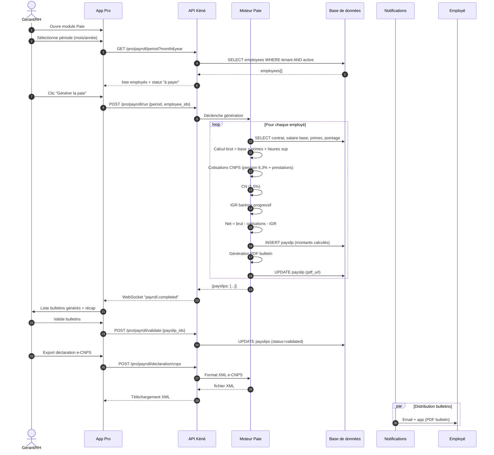
```mermaid
sequenceDiagram
    autonumber
    actor G as Gérant/RH
    participant Pro as App Pro
    participant API as API Kènè
    participant Pay as Moteur Paie
    participant DB as Base de données
    participant Notif as Notifications

    G->>Pro: Ouvre module Paie
    G->>Pro: Sélectionne période (mois/année)
    Pro->>API: GET /pro/payroll/period?month&year
    API->>DB: SELECT employees WHERE tenant AND active
    DB-->>API: employees[]
    API-->>Pro: liste employés + statut "à payer"

    G->>Pro: Clic "Générer la paie"
    Pro->>API: POST /pro/payroll/run {period, employee_ids}
    API->>Pay: Déclenche génération

    loop Pour chaque employé
        Pay->>DB: SELECT contrat, salaire base, primes, pointage
        Pay->>Pay: Calcul brut = base + primes + heures sup
        Pay->>Pay: Cotisations CNPS (pension 6,3% + prestations)
        Pay->>Pay: CN (1,5%)
        Pay->>Pay: IGR barème progressif
        Pay->>Pay: Net = brut - cotisations - IGR
        Pay->>DB: INSERT payslip (montants calculés)
        Pay->>Pay: Génération PDF bulletin
        Pay->>DB: UPDATE payslip (pdf_url)
    end

    Pay-->>API: {payslips: [...]}
    API-->>Pro: WebSocket "payroll.completed"
    Pro->>G: Liste bulletins générés + récap

    G->>Pro: Valide bulletins
    Pro->>API: POST /pro/payroll/validate {payslip_ids}
    API->>DB: UPDATE payslips (status=validated)

    G->>Pro: Export déclaration e-CNPS
    Pro->>API: POST /pro/payroll/declaration/cnps
    API->>Pay: Format XML e-CNPS
    Pay-->>API: fichier XML
    API-->>Pro: Téléchargement XML

    par Distribution bulletins
        Notif->>Employé: Email + app (PDF bulletin)
    end
```

### 1.5 Séquence : Réconciliation Mobile Money quotidienne

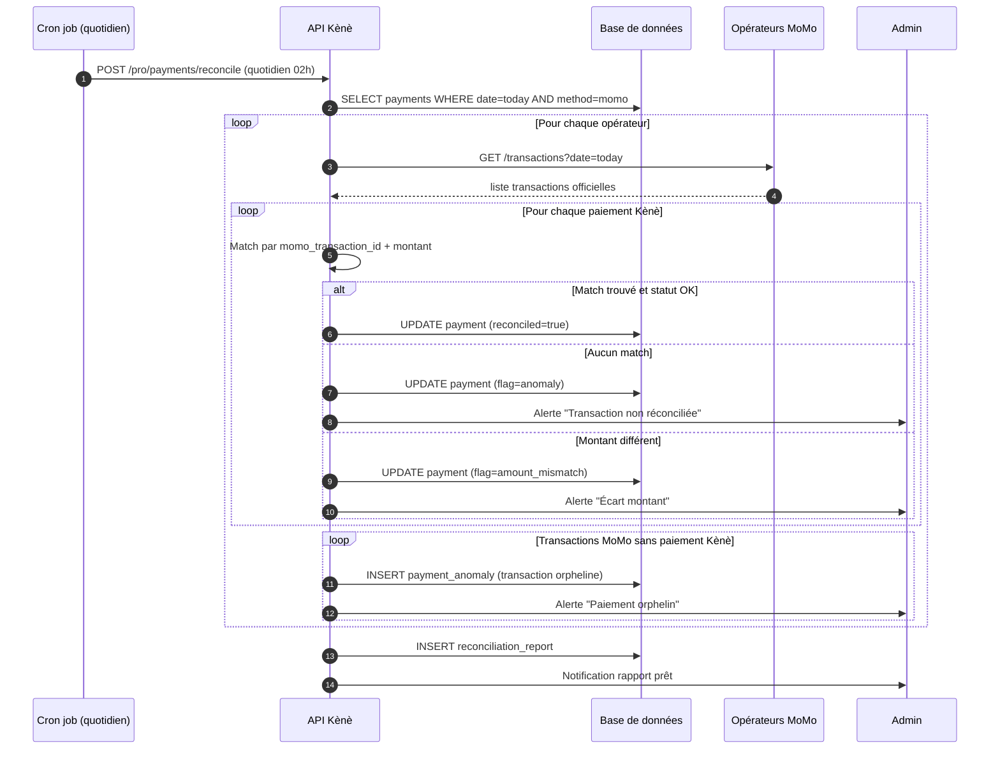
```mermaid
sequenceDiagram
    autonumber
    participant Cron as Cron job (quotidien)
    participant API as API Kènè
    participant DB as Base de données
    participant MoMo as Opérateurs MoMo
    participant Ad as Admin

    Cron->>API: POST /pro/payments/reconcile (quotidien 02h)
    API->>DB: SELECT payments WHERE date=today AND method=momo

    loop Pour chaque opérateur
        API->>MoMo: GET /transactions?date=today
        MoMo-->>API: liste transactions officielles

        loop Pour chaque paiement Kènè
            API->>API: Match par momo_transaction_id + montant
            alt Match trouvé et statut OK
                API->>DB: UPDATE payment (reconciled=true)
            else Aucun match
                API->>DB: UPDATE payment (flag=anomaly)
                API->>Ad: Alerte "Transaction non réconciliée"
            else Montant différent
                API->>DB: UPDATE payment (flag=amount_mismatch)
                API->>Ad: Alerte "Écart montant"
            end
        end

        loop Transactions MoMo sans paiement Kènè
            API->>DB: INSERT payment_anomaly (transaction orpheline)
            API->>Ad: Alerte "Paiement orphelin"
        end
    end

    API->>DB: INSERT reconciliation_report
    API->>Ad: Notification rapport prêt
```

---

## 2. DIAGRAMMES D'ÉTAT

### 2.1 Cycle de vie RDV

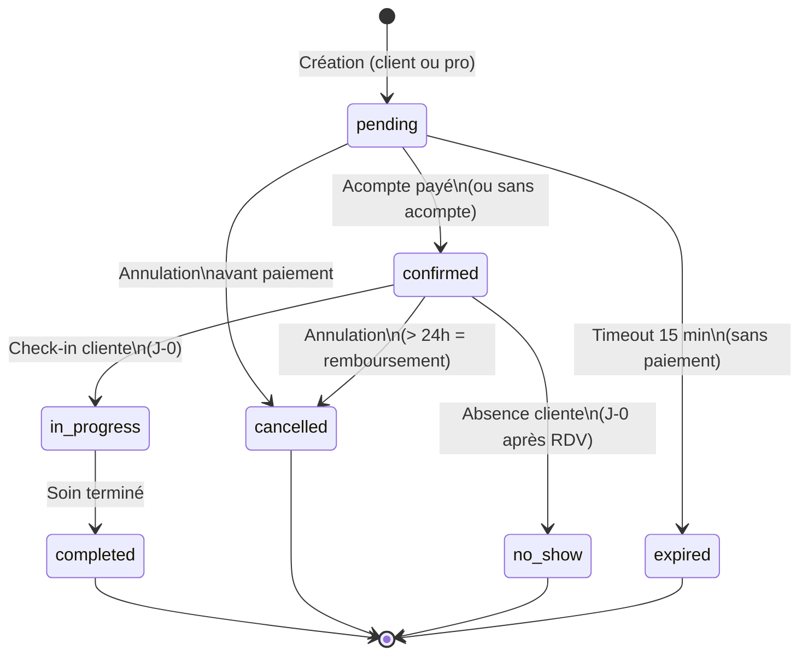
```mermaid
stateDiagram-v2
    [*] --> pending: Création (client ou pro)
    pending --> confirmed: Acompte payé\n(ou sans acompte)
    pending --> cancelled: Annulation\navant paiement
    pending --> expired: Timeout 15 min\n(sans paiement)

    confirmed --> in_progress: Check-in cliente\n(J-0)
    confirmed --> cancelled: Annulation\n(> 24h = remboursement)
    confirmed --> no_show: Absence cliente\n(J-0 après RDV)

    in_progress --> completed: Soin terminé
    completed --> [*]

    cancelled --> [*]
    no_show --> [*]
    expired --> [*]
```

### 2.2 Cycle de vie paiement

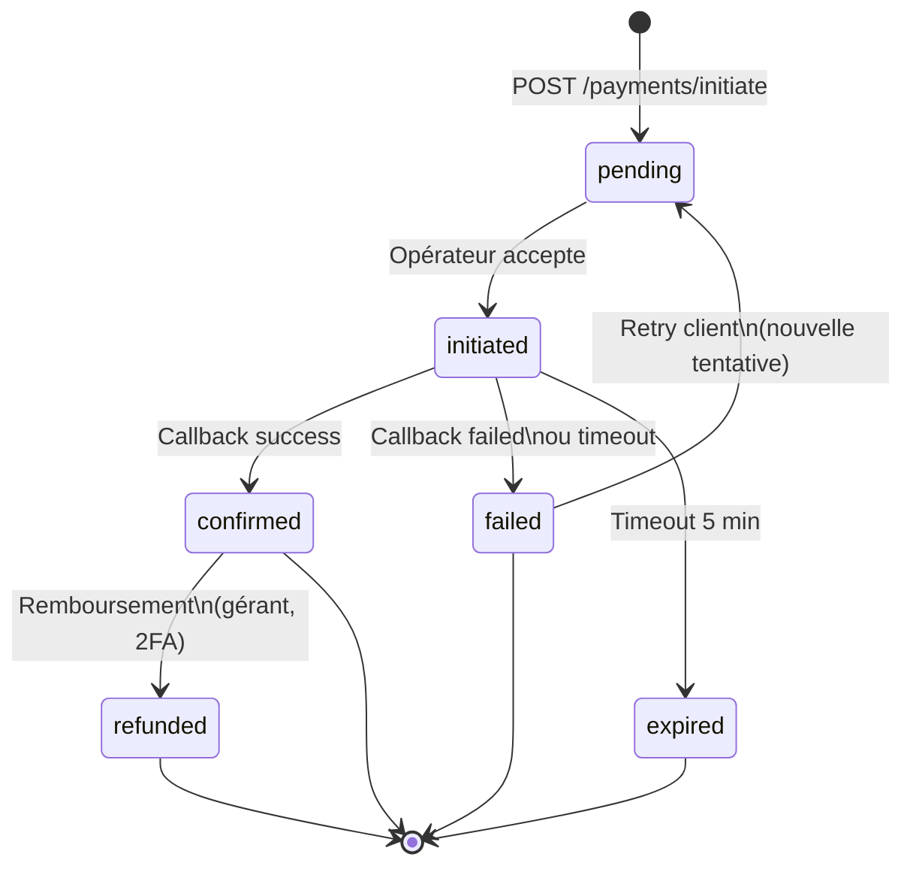
```mermaid
stateDiagram-v2
    [*] --> pending: POST /payments/initiate
    pending --> initiated: Opérateur accepte
    initiated --> confirmed: Callback success
    initiated --> failed: Callback failed\nou timeout
    initiated --> expired: Timeout 5 min

    confirmed --> refunded: Remboursement\n(gérant, 2FA)
    confirmed --> [*]

    failed --> pending: Retry client\n(nouvelle tentative)
    failed --> [*]

    expired --> [*]
    refunded --> [*]
```

### 2.3 Cycle de vie vente

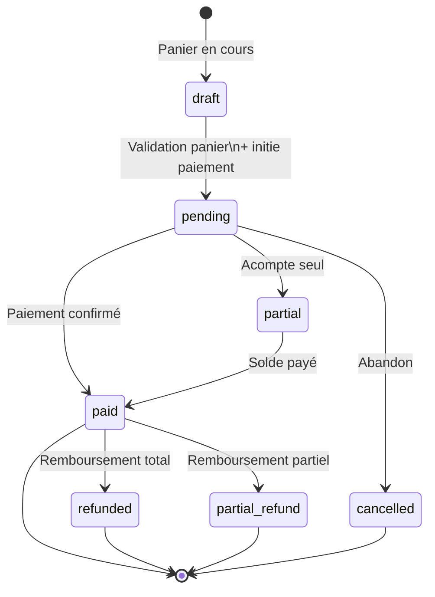
```mermaid
stateDiagram-v2
    [*] --> draft: Panier en cours
    draft --> pending: Validation panier\n+ initie paiement
    pending --> paid: Paiement confirmé
    pending --> partial: Acompte seul
    pending --> cancelled: Abandon
    partial --> paid: Solde payé

    paid --> refunded: Remboursement total
    paid --> partial_refund: Remboursement partiel

    paid --> [*]
    refunded --> [*]
    partial_refund --> [*]
    cancelled --> [*]
```

### 2.4 Cycle de vie commande produit

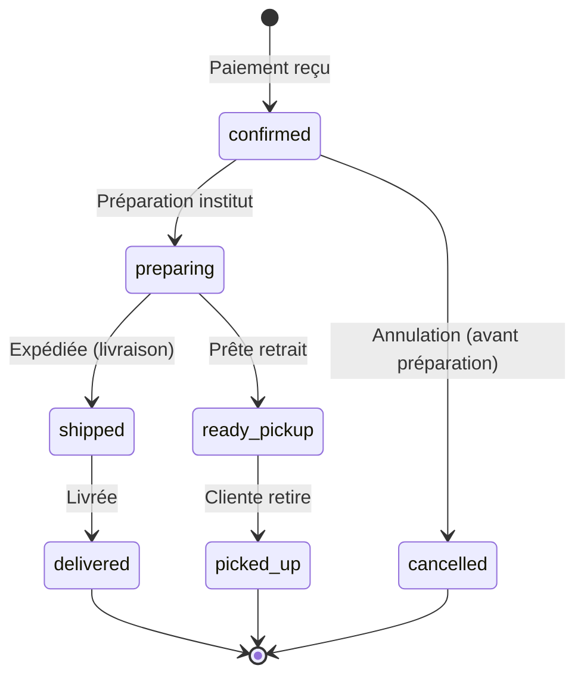
```mermaid
stateDiagram-v2
    [*] --> confirmed: Paiement reçu
    confirmed --> preparing: Préparation institut
    preparing --> ready_pickup: Prête retrait
    preparing --> shipped: Expédiée (livraison)
    shipped --> delivered: Livrée
    ready_pickup --> picked_up: Cliente retire
    confirmed --> cancelled: Annulation (avant préparation)

    delivered --> [*]
    picked_up --> [*]
    cancelled --> [*]
```

### 2.5 Cycle de vie employé

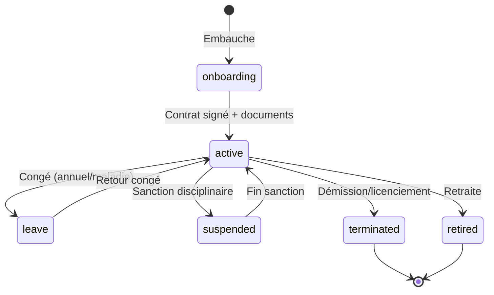
```mermaid
stateDiagram-v2
    [*] --> onboarding: Embauche
    onboarding --> active: Contrat signé + documents
    active --> leave: Congé (annuel/maladie)
    leave --> active: Retour congé
    active --> suspended: Sanction disciplinaire
    suspended --> active: Fin sanction
    active --> terminated: Démission/licenciement
    active --> retired: Retraite
    terminated --> [*]
    retired --> [*]
```

### 2.6 Cycle de vie bulletin paie

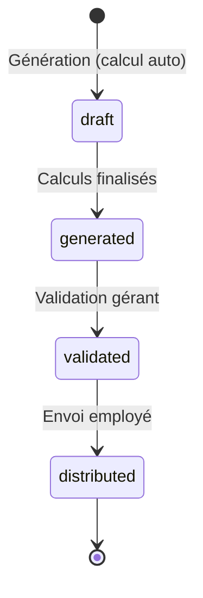
```mermaid
stateDiagram-v2
    [*] --> draft: Génération (calcul auto)
    draft --> generated: Calculs finalisés
    generated --> validated: Validation gérant
    validated --> distributed: Envoi employé
    distributed --> [*]
```

---

## 3. DIAGRAMMES D'ACTIVITÉ

### 3.1 Process clôture comptable mensuelle

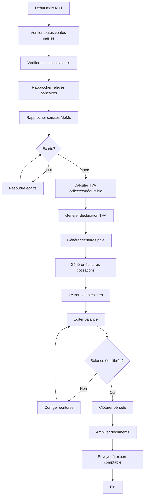
```mermaid
flowchart TD
    A[Début mois M+1] --> B[Vérifier toutes ventes saisies]
    B --> C[Vérifier tous achats saisis]
    C --> D[Rapprocher relevés bancaires]
    D --> E[Rapprocher caisses MoMo]
    E --> F{Écarts?}
    F -->|Oui| G[Résoudre écarts]
    G --> F
    F -->|Non| H[Calculer TVA collectée/déductible]
    H --> I[Générer déclaration TVA]
    I --> J[Générer écritures paie]
    J --> K[Générer écritures cotisations]
    K --> L[Lettrer comptes tiers]
    L --> M[Éditer balance]
    M --> N{Balance équilibrée?}
    N -->|Non| O[Corriger écritures]
    O --> M
    N -->|Oui| P[Clôturer période]
    P --> Q[Archiver documents]
    Q --> R[Envoyer à expert-comptable]
    R --> S[Fin]
```

### 3.2 Process inventaire stock

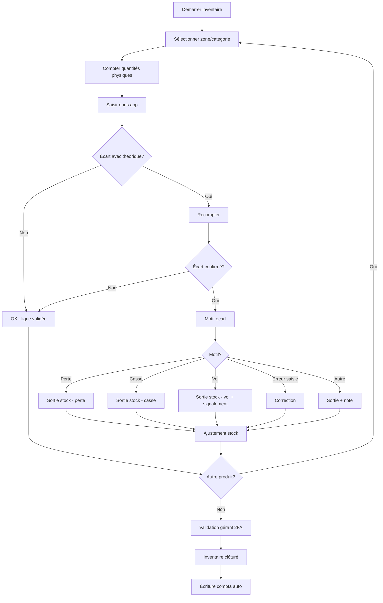
```mermaid
flowchart TD
    A[Démarrer inventaire] --> B[Sélectionner zone/catégorie]
    B --> C[Compter quantités physiques]
    C --> D[Saisir dans app]
    D --> E{Écart avec théorique?}
    E -->|Non| F[OK - ligne validée]
    E -->|Oui| G[Recompter]
    G --> H{Écart confirmé?}
    H -->|Non| F
    H -->|Oui| I[Motif écart]
    I --> J{Motif?}
    J -->|Perte| K[Sortie stock - perte]
    J -->|Casse| L[Sortie stock - casse]
    J -->|Vol| M[Sortie stock - vol + signalement]
    J -->|Erreur saisie| N[Correction]
    J -->|Autre| O[Sortie + note]
    K --> P[Ajustement stock]
    L --> P
    M --> P
    N --> P
    O --> P
    F --> Q{Autre produit?}
    P --> Q
    Q -->|Oui| B
    Q -->|Non| R[Validation gérant 2FA]
    R --> S[Inventaire clôturé]
    S --> T[Écriture compta auto]
```

### 3.3 Process onboarding entreprise (KYB)

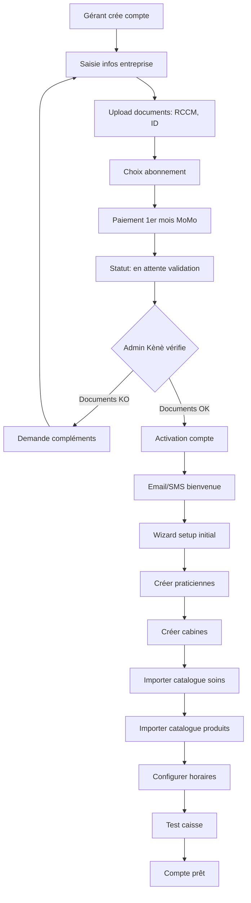
```mermaid
flowchart TD
    A[Gérant crée compte] --> B[Saisie infos entreprise]
    B --> C[Upload documents: RCCM, ID]
    C --> D[Choix abonnement]
    D --> E[Paiement 1er mois MoMo]
    E --> F[Statut: en attente validation]
    F --> G{Admin Kènè vérifie}
    G -->|Documents KO| H[Demande compléments]
    H --> B
    G -->|Documents OK| I[Activation compte]
    I --> J[Email/SMS bienvenue]
    J --> K[Wizard setup initial]
    K --> L[Créer praticiennes]
    L --> M[Créer cabines]
    M --> N[Importer catalogue soins]
    N --> O[Importer catalogue produits]
    O --> P[Configurer horaires]
    P --> Q[Test caisse]
    Q --> R[Compte prêt]
```

---

## 4. DIAGRAMMES DE CLASSE (entités principales)

### 4.1 Module CRM & RDV

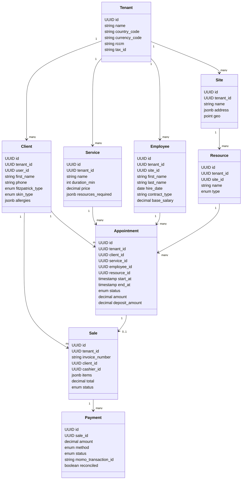
```mermaid
classDiagram
    class Tenant {
        UUID id
        string name
        string country_code
        string currency_code
        string rccm
        string tax_id
    }
    class Site {
        UUID id
        UUID tenant_id
        string name
        jsonb address
        point geo
    }
    class Employee {
        UUID id
        UUID tenant_id
        UUID site_id
        string first_name
        string last_name
        date hire_date
        string contract_type
        decimal base_salary
    }
    class Client {
        UUID id
        UUID tenant_id
        UUID user_id
        string first_name
        string phone
        enum fitzpatrick_type
        enum skin_type
        jsonb allergies
    }
    class Service {
        UUID id
        UUID tenant_id
        string name
        int duration_min
        decimal price
        jsonb resources_required
    }
    class Resource {
        UUID id
        UUID tenant_id
        UUID site_id
        string name
        enum type
    }
    class Appointment {
        UUID id
        UUID tenant_id
        UUID client_id
        UUID service_id
        UUID employee_id
        UUID resource_id
        timestamp start_at
        timestamp end_at
        enum status
        decimal amount
        decimal deposit_amount
    }
    class Sale {
        UUID id
        UUID tenant_id
        string invoice_number
        UUID client_id
        UUID cashier_id
        jsonb items
        decimal total
        enum status
    }
    class Payment {
        UUID id
        UUID sale_id
        decimal amount
        enum method
        enum status
        string momo_transaction_id
        boolean reconciled
    }

    Tenant "1" --> "many" Site
    Tenant "1" --> "many" Employee
    Tenant "1" --> "many" Client
    Tenant "1" --> "many" Service
    Site "1" --> "many" Resource
    Client "1" --> "many" Appointment
    Service "1" --> "many" Appointment
    Employee "1" --> "many" Appointment
    Resource "1" --> "many" Appointment
    Client "1" --> "many" Sale
    Sale "1" --> "many" Payment
    Appointment "1" --> "0..1" Sale
```

### 4.2 Module Diagnostic IA

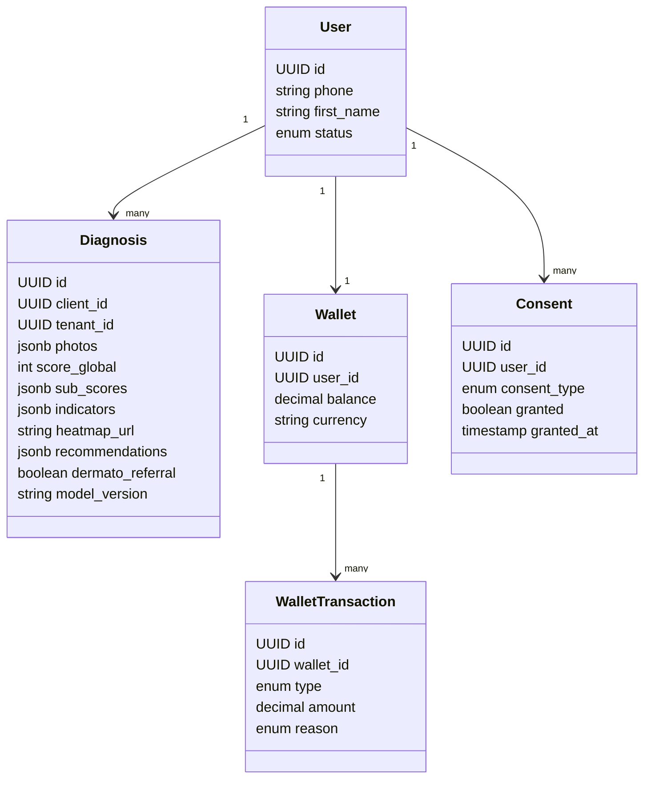
```mermaid
classDiagram
    class User {
        UUID id
        string phone
        string first_name
        enum status
    }
    class Diagnosis {
        UUID id
        UUID client_id
        UUID tenant_id
        jsonb photos
        int score_global
        jsonb sub_scores
        jsonb indicators
        string heatmap_url
        jsonb recommendations
        boolean dermato_referral
        string model_version
    }
    class Wallet {
        UUID id
        UUID user_id
        decimal balance
        string currency
    }
    class WalletTransaction {
        UUID id
        UUID wallet_id
        enum type
        decimal amount
        enum reason
    }
    class Consent {
        UUID id
        UUID user_id
        enum consent_type
        boolean granted
        timestamp granted_at
    }

    User "1" --> "many" Diagnosis
    User "1" --> "1" Wallet
    Wallet "1" --> "many" WalletTransaction
    User "1" --> "many" Consent
```

---

## 5. DIAGRAMMES D'ARCHITECTURE (C4 Model)

### 5.1 Niveau 1 — Contexte système

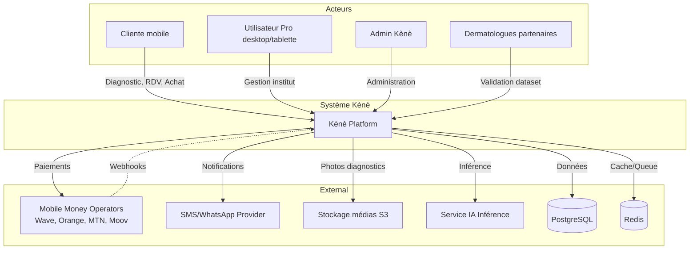
```mermaid
graph TB
    subgraph "Acteurs"
        CL[Cliente mobile]
        PR[Utilisateur Pro desktop/tablette]
        AD[Admin Kènè]
        DER[Dermatologues partenaires]
    end

    subgraph "Système Kènè"
        K[Kènè Platform]
    end

    subgraph "External"
        MOMO[Mobile Money Operators<br/>Wave, Orange, MTN, Moov]
        SMS[SMS/WhatsApp Provider]
        S3[Stockage médias S3]
        IA[Service IA Inférence]
        DB[(PostgreSQL)]
        REDIS[(Redis)]
    end

    CL -->|Diagnostic, RDV, Achat| K
    PR -->|Gestion institut| K
    AD -->|Administration| K
    DER -->|Validation dataset| K

    K -->|Paiements| MOMO
    K -->|Notifications| SMS
    K -->|Photos diagnostics| S3
    K -->|Inférence| IA
    K -->|Données| DB
    K -->|Cache/Queue| REDIS

    MOMO -.->|Webhooks| K
```

### 5.2 Niveau 2 — Conteneurs

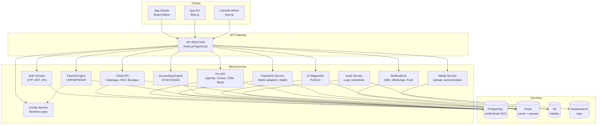
```mermaid
graph TB
    subgraph "Clients"
        CL[App Cliente<br/>React Native]
        PR[App Pro<br/>Next.js]
        AD[Console Admin<br/>Next.js]
    end

    subgraph "API Gateway"
        GW[API REST/WS<br/>Node.js/TypeScript]
    end

    subgraph "Microservices"
        AUTH[Auth Service<br/>OTP, JWT, 2FA]
        CLIENT[Client API<br/>Catalogue, RDV, Boutique]
        PRO[Pro API<br/>Agenda, Caisse, CRM, Stock]
        PAY[Payments Service<br/>MoMo adapters, Wallet]
        PAYROLL[Payroll Engine<br/>CNPS/IPM/IGR]
        ACCT[Accounting Engine<br/>SYSCOHADA]
        DIAG[AI Diagnostic<br/>PyTorch]
        NOTIF[Notifications<br/>SMS, WhatsApp, Push]
        MEDIA[Media Service<br/>Upload, anonymisation]
        AUDIT[Audit Service<br/>Logs centralisés]
        CONFIG[Config Service<br/>Barèmes pays]
    end

    subgraph "Données"
        DB[(PostgreSQL<br/>multi-tenant RLS)]
        REDIS[(Redis<br/>cache + queues)]
        S3[(S3<br/>médias)]
        ES[(Elasticsearch<br/>logs)]
    end

    CL --> GW
    PR --> GW
    AD --> GW

    GW --> AUTH
    GW --> CLIENT
    GW --> PRO
    GW --> PAY
    GW --> PAYROLL
    GW --> ACCT
    GW --> DIAG
    GW --> NOTIF
    GW --> MEDIA
    GW --> CONFIG

    AUTH --> DB
    CLIENT --> DB
    CLIENT --> REDIS
    PRO --> DB
    PRO --> REDIS
    PAY --> DB
    PAY --> REDIS
    PAYROLL --> DB
    PAYROLL --> CONFIG
    ACCT --> DB
    DIAG --> DB
    DIAG --> S3
    NOTIF --> REDIS
    MEDIA --> S3
    AUDIT --> ES
    AUDIT --> DB
```

### 5.3 Niveau 3 — Déploiement (AWS af-south-1)

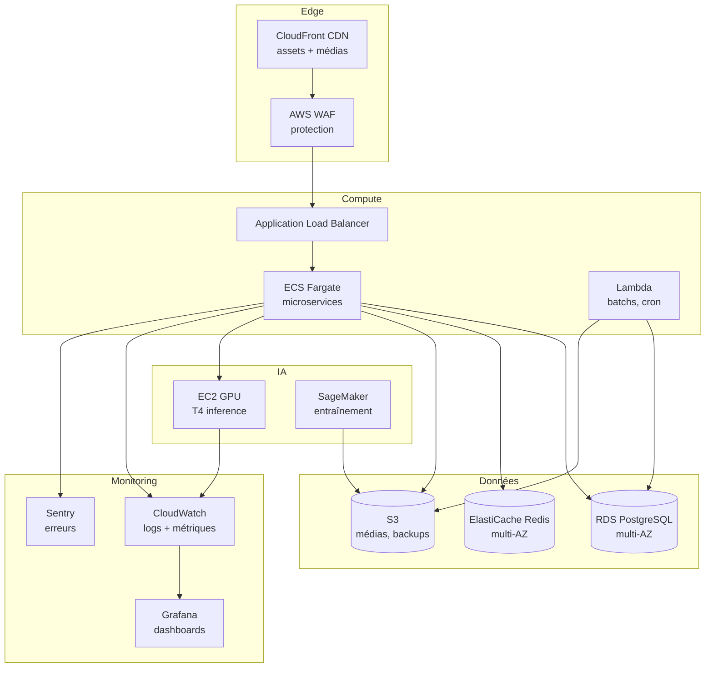
```mermaid
graph TB
    subgraph "Edge"
        CDN[CloudFront CDN<br/>assets + médias]
        WAF[AWS WAF<br/>protection]
    end

    subgraph "Compute"
        ALB[Application Load Balancer]
        ECS[ECS Fargate<br/>microservices]
        LAMBDA[Lambda<br/>batchs, cron]
    end

    subgraph "Données"
        RDS[(RDS PostgreSQL<br/>multi-AZ)]
        ELA[(ElastiCache Redis<br/>multi-AZ)]
        S3[(S3<br/>médias, backups)]
    end

    subgraph "IA"
        EC2[EC2 GPU<br/>T4 inference]
        SAG[SageMaker<br/>entraînement]
    end

    subgraph "Monitoring"
        CW[CloudWatch<br/>logs + métriques]
        GR[Grafana<br/>dashboards]
        SEN[Sentry<br/>erreurs]
    end

    CDN --> WAF
    WAF --> ALB
    ALB --> ECS
    ECS --> RDS
    ECS --> ELA
    ECS --> S3
    ECS --> EC2
    LAMBDA --> RDS
    LAMBDA --> S3
    SAG --> S3
    ECS --> CW
    EC2 --> CW
    CW --> GR
    ECS --> SEN
```

### 5.4 Flux de données (DFD — Diagnostic IA)

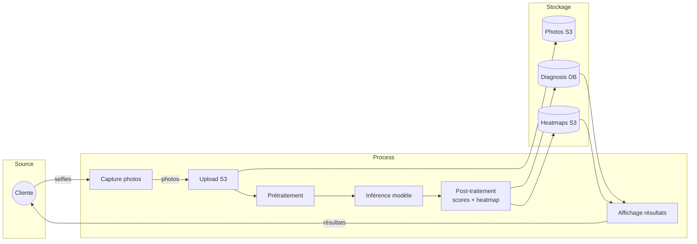
```mermaid
graph LR
    subgraph "Source"
        C((Cliente))
    end

    subgraph "Process"
        P1[Capture photos]
        P2[Upload S3]
        P3[Prétraitement]
        P4[Inférence modèle]
        P5[Post-traitement<br/>scores + heatmap]
        P6[Affichage résultats]
    end

    subgraph "Stockage"
        D1[(Photos S3)]
        D2[(Diagnosis DB)]
        D3[(Heatmaps S3)]
    end

    C -->|selfies| P1
    P1 -->|photos| P2
    P2 --> D1
    P2 --> P3
    P3 --> P4
    P4 --> P5
    P5 --> D3
    P5 --> D2
    D2 --> P6
    D3 --> P6
    P6 -->|résultats| C
```

---

## 6. DIAGRAMMES DE FLUX UTILISATEUR

### 6.1 Flow cliente — du diagnostic à l'achat

```mermaid
flowchart LR
    A[Onboarding] --> B[Profil peau]
    B --> C[Consentement santé]
    C --> D[Diagnostic IA]
    D --> E{Lésion suspecte?}
    E -->|Oui| F[Orientation dermato]
    E -->|Non| G[Résultats + score]
    G --> H[Recommandations routine]
    H --> I{Action?}
    I -->|Réserver soin| J[Recherche institut]
    I -->|Acheter produits| K[Boutique]
    J --> L[Sélection créneau]
    L --> M[Paiement acompte MoMo]
    M --> N[Confirmation RDV]
    K --> O[Panier]
    O --> P[Paiement MoMo]
    P --> Q[Confirmation commande]
    F --> R[RDV dermato]
```

### 6.2 Flow gérant — mise en service institut

```mermaid
flowchart TD
    A[Inscription entreprise] --> B[KYB documents]
    B --> C[Validation admin]
    C --> D[Wizard setup]
    D --> E[Créer praticiennes]
    E --> F[Créer cabines]
    F --> G[Catalogue soins]
    G --> H[Catalogue produits]
    H --> I[Horaires]
    I --> J[Test caisse]
    J --> K[Compte actif]
    K --> L[Premier RDV en ligne]
```

---

## 7. MATRICE DE COMPATIBILITÉ DES MODULES

```mermaid
graph TB
    subgraph "Phase 1A 🔴"
        A1[Onboarding Client]
        A2[Diagnostic IA 10 ind.]
        A3[RDV + Acompte]
        A4[Boutique base]
        A5[Agenda Pro]
        A6[Caisse MoMo]
        A7[CRM]
        A8[Stock base]
        A9[Console admin]
    end

    subgraph "Phase 1B 🟡"
        B1[Suivi temporel]
        B2[Téléconsultation]
        B3[Paie CNPS/IPM]
        B4[Compta SYSCOHADA]
        B5[Marketing SMS/WA]
        B6[Fidélité + Wallet]
        B7[Multi-sites]
        B8[Reporting avancé]
        B9[IA 20 indicateurs]
    end

    subgraph "Phase 2+ 🟢"
        C1[Extension ML/BF]
        C2[Cameroun]
        C3[Marketplace panafricaine]
        C4[Nigeria/Ghana]
        C5[Langues locales]
        C6[IA nouvelles indications]
    end

    A1 --> A2 --> A3 --> A4
    A5 --> A6 --> A7 --> A8
    A9 --> A1
    A2 --> B1
    A3 --> B2
    A7 --> B3 --> B4
    A6 --> B5
    A4 --> B6
    A8 --> B7
    A7 --> B8
    A2 --> B9
    B3 --> C1
    B4 --> C2
    A4 --> C3
    B5 --> C4
    B9 --> C6
```

---

*Fin de la Partie 6. Les diagrammes UML et d'architecture couvrent les flux critiques, états, processus et architecture système.*
