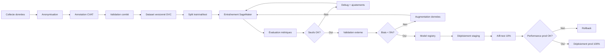
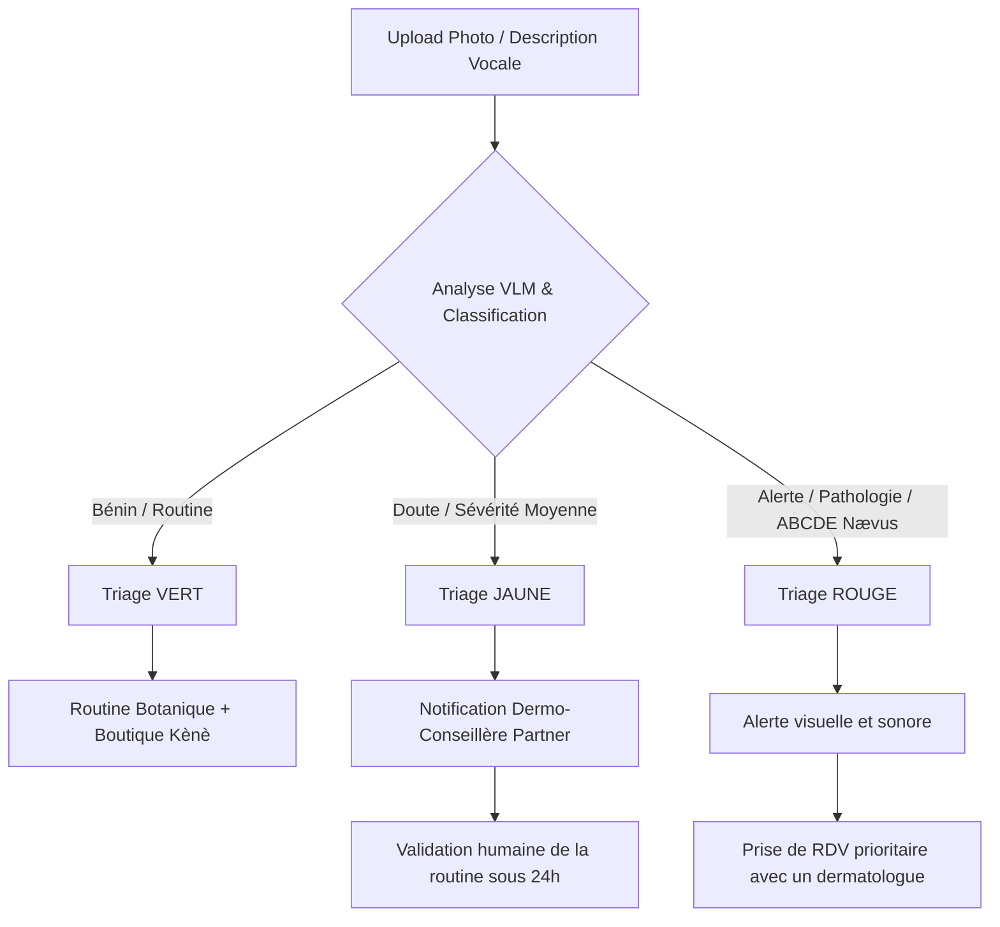

# Partie 8 — Spécifications IA Approfondies

> Dataset, modèle, MLOps, éthique, conformité médicale
> Le moteur IA diagnostic peau mélanoderme est le cœur différenciant de Kènè

---

## 1. DATASET — Constitution & gouvernance

### 1.1 Cible de dataset

| Indicateur | Cible MVP 1A | Cible Phase 2 | Cible Phase 4 |
|---|---|---|---|
| **Images totales** | 50 000 | 200 000 | 500 000 |
| **Patients uniques** | 5 000 | 25 000 | 75 000 |
| **Diversité pays** | CI + SN | + ML, BF, Cameroun | + Nigeria, Kenya, Afrique du Sud |
| **Carnations Fitzpatrick** | IV-VI ≥ 80% | IV-VI ≥ 75% | IV-VI ≥ 70% |
| **Âges** | 18-70+ | 18-70+ | 18-70+ |
| **Genres** | H/F équilibré | H/F équilibré | H/F/autres |

### 1.2 Sources de données

#### Sources cliniques (partenariats)
| Source | Pays | Type données | Statut |
|---|---|---|---|
| CHU Cocody (service dermatologie) | CI | Photos cliniques + diagnostics | À engager |
| CHU Treichville (dermatologie) | CI | Photos + cas | À engager |
| CHU Fann (dermatologie) | SN | Photos + cas | À engager |
| CHU Aristide Le Dantec | SN | Photos + cas | À engager |
| Société Ivoirienne de Dermatologie | CI | Réseau dermato | À engager |
| Société Sénégalaise de Dermatologie | SN | Réseau dermato | À engager |
| Université Félix Houphouët-Boigny | CI | Recherche académique | À engager |
| UCAD Dakar | SN | Recherche académique | À engager |
| Instituts partenaires Kènè | CI/SN | Photos clientes (consentement) | Phase 1A |
| Comité scientifique africain | Panafricain | Validation éthique | À constituer |

#### Sources open-source (complément)
- **ISIC Archive** (International Skin Imaging Collaboration) — filtrer peaux mélanodermes
- **DermNet NZ** — cas cliniques
- **HAM10000** — nævi (à filtrer)
- Publications PubMed avec datasets

### 1.3 Protocole de collecte

#### Phase de capture
- **Appareils** : smartphones (représentatif réalité cliente)
- **Résolution** : minimum 1080p
- **Éclairage** : lumière naturelle + LED diffuse (standardisé)
- **Distance** : 15-30 cm visage, 5-10 cm zones spécifiques
- **Multi-zones** : visage entier + front + joues + menton (standard Kènè)
- **Cadrage** : assistance IA temps réel pendant capture

#### Données associées (métadonnées)
```yaml
metadata:
  patient_id_anonymisé: UUID
  age_range: "25-34"
  gender: F
  fitzpatrick: V
  country: CI
  capture_date: 2025-01-15
  device_model: "Samsung A52"
  lighting_condition: "natural_daylight"
  zones: [face_full, forehead, left_cheek, right_cheek, chin]
  diagnostic_clinique:
    - condition: PIH
    severity: 2
    zones: [left_cheek, right_cheek]
  dermatologue_validateur: Dr. X
  date_validation: 2025-01-20
```

### 1.4 Annotation & labellisation

#### Protocole d'annotation
1. **Annotation primaire** : dermatologue senior (1 par image)
2. **Double annotation** : 2nd dermatologue (échantillon 30%)
3. **Conflit** : arbitrage par 3e dermatologue
4. **Consensus** : κ de Cohen ≥ 0,7 requis

#### Structure d'annotation
```json
{
  "image_id": "...",
  "annotations": [
    {
      "indicator": "PIH",
      "severity": 2,  // 0-3
      "zones": [{"x": 120, "y": 250, "w": 80, "h": 60}],
      "confidence": 0.92
    },
    {
      "indicator": "acne",
      "severity": 1,
      "zones": [...],
      "confidence": 0.88
    }
  ],
  "annotator_id": "...",
  "validation_status": "validated"
}
```

#### Outil d'annotation
- **CVAT** (Computer Vision Annotation Tool) open-source
- Interface dédiée avec liste indicateurs Kènè
- Workflow : en attente → en annotation → en validation → validé / rejeté

### 1.5 Gouvernance éthique

#### Comité scientifique africain
- **Composition** : 5-7 dermatologues (CI, SN, ML, Cameroun, Nigeria, Kenya)
- **Rôle** : validation protocoles, arbitrage conflits, supervision qualité
- **Réunions** : trimestrielles

#### Consentement patient
- **Formulaire** : en français (+ langues locales Phase 2)
- **Contenu** : finalité, destinataires, durée, droit de retrait
- **Signature** : numérique (nom + case à cocher)
- **Révocabilité** : à tout moment (suppression données)
- **Distinction** :
  - Consentement diagnostic (service client) — révocable
  - Consentement recherche (anonymisation + entraînement IA) — séparé, opt-in

#### Anonymisation
- Suppression EXIF (métadonnées photo)
- Pas d'identifiant patient dans dataset
- Hash irréversible (patient_id → dataset_id)
- Pas de reconnaissance faciale (visages floutés pour sous-zones si besoin)

### 1.6 Biais & diversité — surveillance

| Biais à surveiller | Mitigation |
|---|---|
| Carnation sous-représentée (Fitzpatrick VI) | Sur-échantillonnage + augmentation données |
| Genre déséquilibré | Équilibrage volontaire |
| Âge déséquilibré (jeunes majoritaires) | Campagne recrutement 45+ |
| Géographique (1 pays dominant) | Objectif pays multiples dès Phase 1 |
| Conditions capture (lumière) | Diversité appareils + conditions |

**Métrique d'équité** : différence de précision entre sous-groupes < 5% (objectif)

---

## 2. MODÈLE IA — Architecture & entraînement

### 2.1 Architecture modèle (Phase 1A)

#### Approche
- **Backbone** : EfficientNet-B4 ou ConvNeXt-Tiny (pré-entraîné ImageNet)
- **Transfer learning** : fine-tuning sur dataset Kènè
- **Multi-tâches** : 10 têtes (1 par indicateur) + 1 tête score global
- **Heatmap** : Grad-CAM pour explicabilité

#### Architecture détaillée
```
Input (224×224×3)
  ↓
EfficientNet-B4 backbone (fine-tuné)
  ↓
Feature map (14×14×1792)
  ↓
[Branches parallèles]
  ├── Tête PIH : GAP → Dense(256) → Dropout(0.3) → Dense(4) [softmax sévérité]
  ├── Tête Mélasma : ...
  ├── Tête Acné : ...
  ├── Tête PFB : ...
  ├── Tête Pores : ...
  ├── Tête Texture : ...
  ├── Tête Séborrhée : ...
  ├── Tête Ridules : ...
  ├── Tête Taches : ...
  ├── Tête Nævi : ...
  └── Tête Score global : GAP → Dense(512) → Dense(1) [régression 0-100]
  ↓
Heatmap : Grad-CAM (par indicateur)
```

#### Justification
- **EfficientNet-B4** : bon ratio performance/taille (adapté mobile edge inference)
- **Multi-tâches** : partage de features + spécialisation par indicateur
- **Grad-CAM** : explicabilité (transparence client + dermatologues)

### 2.2 Hyperparamètres entraînement

| Paramètre | Valeur |
|---|---|
| Optimizer | AdamW |
| Learning rate | 1e-4 (backbone), 1e-3 (têtes) |
| Scheduler | Cosine annealing |
| Batch size | 32 |
| Epochs | 50 (early stopping) |
| Loss | Weighted categorical cross-entropy (par tête) + MSE (score global) |
| Data augmentation | Rotation (±30°), flip horizontal, brightness (±20%), contrast, Random Erasing |
| Regularization | Dropout 0.3, L2 1e-5 |
| Validation split | 80/10/10 (train/val/test) stratifié par patient |

### 2.3 Métriques d'évaluation

#### Métriques par indicateur (classification sévérité 0-3)
- **Accuracy** globale
- **Precision / Recall / F1** par classe
- **AUC-ROC** multi-classe
- **Matrice de confusion**

#### Métriques globales
- **MAE** (Mean Absolute Error) sur score global
- **R²** score global
- **Cohérence** avec dermatologues (κ de Cohen)

#### Seuils de qualité (avant déploiement)
| Indicateur | F1 min | Precision min | Recall min |
|---|---|---|---|
| PIH | 0,80 | 0,82 | 0,78 |
| Acné | 0,82 | 0,85 | 0,80 |
| Mélasma | 0,78 | 0,80 | 0,75 |
| Nævi (ABCDE) | 0,90 | 0,95 | 0,85 (rappel critique) |
| Score global (MAE) | < 8 points | — | — |

> **Nævi** : seuil recall élevé car l'orientation dermatologique est critique (sécurité patient)

### 2.4 Stratégie de validation

#### Validation croisée
- **K-fold** (k=5) stratifié par patient (éviter fuite)
- **Test set** isolé (jamais vu pendant entraînement)

#### Validation externe
- **Dataset indépendant** (collecte spécifique, non chevauchement)
- **Étude clinique** : comparaison IA vs dermatologues (n=500 cas)

#### Biais par sous-groupe
- Performance par **carnation Fitzpatrick** (IV, V, VI)
- Performance par **genre**
- Performance par **âge** (tranches)
- Performance par **pays**
- **Différence max acceptable** : 5%

---

## 3. INFÉRENCE — Cloud & Edge

### 3.1 Inférence cloud (qualité maximale)

#### Architecture
- **Service** : API Python (FastAPI) sur EC2 GPU (NVIDIA T4)
- **Modèle** : EfficientNet-B4 complet (float32)
- **Latence cible** : < 3 secondes par diagnostic (10 indicateurs)
- **Throughput** : 50 diagnostics simultanés par instance GPU

#### Pipeline d'inférence
```
1. Réception photos (S3 URLs)
2. Prétraitement :
   - Redimensionnement (224×224)
   - Normalisation (mean/std ImageNet)
   - Augmentation test-time (TTA) : 5 variantes
3. Inférence EfficientNet-B4 (10 têtes + score)
4. Moyenne des TTA
5. Post-traitement :
   - Génération Grad-CAM heatmap par indicateur
   - Calcul score global pondéré
   - Génération recommandations (rules engine)
   - Vérification ABCDE nævi
6. Persistance résultats (DB + S3 heatmap)
7. Notification WebSocket client
```

### 3.2 Inférence edge (offline)

#### Objectif
- Diagnostic offline pour zones à connectivité intermittente
- Pas de dépendance cloud

#### Modèle quantifié
- **Technique** : Quantization post-training (int8)
- **Taille** : < 25 MB
- **Framework** : TensorFlow Lite ou ONNX Runtime Mobile
- **Latence** : < 8 secondes sur smartphone milieu de gamme

#### Modèle allégé
- **Architecture** : MobileNetV3-Small (backbone)
- **Têtes** : 5 indicateurs prioritaires (PIH, Acné, Mélasma, Taches, Nævi)
- **Score global** : approximatif (synchro cloud pour complet)

#### Synchronisation
- Diagnostic edge → queue locale
- Connexion revenue → sync cloud → inférence complète → mise à jour résultats
- Notification push « Votre diagnostic complet est prêt »

### 3.3 Versioning modèle

| Élément | Détail |
|---|---|
| **Versioning** | SemVer (Majeur.Mineur.Patch) |
| **Tags** | `v1.0.0`, `v1.1.0`, etc. |
| **Storing** : modèle + hyperparamètres + dataset version + métriques |
| **A/B testing** : 10% trafic sur nouvelle version pendant 1 semaine |
| **Rollback** : < 5 min en cas de régression |
| **Model registry** : MLflow ou SageMaker Model Registry |

---

## 4. MLOps — Pipeline complet

### 4.1 Pipeline d'entraînement



### 4.2 Monitoring en production

#### Métriques techniques
- **Latence** p50, p95, p99
- **Throughput** requêtes/sec
- **Taux d'erreur**
- **Utilisation GPU**

#### Métriques métier
- **Distribution des prédictions** (sévérités par indicateur)
- **Taux d'orientation dermatologique**
- **Satisfaction client** (NPS diagnostic)
- **Volume** diagnostics/jour

#### Détection de drift
- **Data drift** : distribution des images d'entrée (test KS sur features)
- **Concept drift** : si feedback dermatologues disponible
- **Prediction drift** : distribution des sorties
- **Alerte** : drift > seuil → déclenchement ré-entraînement

### 4.3 Ré-entraînement

#### Déclenchement
- **Planifié** : trimestriel
- **Sur alerte** : drift significatif détecté
- **Sur accumulation** : nouveau dataset ≥ 5 000 images

#### Process
1. Collecte nouvelles données (consentement recherche)
2. Annotation (dermatologues)
3. Validation comité
4. Entraînement nouveau modèle
5. Comparaison avec modèle prod (métriques + biais)
6. A/B test staging
7. Déploiement progressif (canary 10% → 50% → 100%)
8. Archivage modèle précédent

### 4.4 Feedback loop

#### Boucle d'apprentissage continu
```
Client reçoit diagnostic
  → Peut donner feedback ("Est-ce pertinent ?")
  → Optionnel : partage avec dermatologue partenaire
  → Diagnostic dermatologue (si consultation)
  → Comparaison IA vs dermato
  → Cas désaccords = priorité annotation
  → Entraînement modèle vNext
```

---

## 5. ÉTHIQUE & CONFORMITÉ MÉDICALE

### 5.1 Cadre « non-diagnostic médical »

**Principe** : Kènè n'émet **pas** de diagnostic médical. C'est un outil de **sensibilisation** et d'**orientation**.

#### Distinctions légales
| Aspect | Kènè (autorisé) | Diagnostic médical (interdit sans agrément) |
|---|---|---|
| Objectif | Sensibilisation, suivi, orientation | Poser diagnostic médical |
| Sortie | « Indicateurs de peau », score, recommandations | « Vous avez X pathologie » |
| Action | Recommander consultation si suspicion | Prescrire traitement |
| Cadre | Bien-être, cosmétique | Médical (ordre des médecins) |

#### Mentions obligatoires app
- « Ceci n'est pas un diagnostic médical »
- « En cas de doute, consultez un dermatologue »
- « Kènè est un outil de sensibilisation cutanée »

### 5.2 Conformité réglementaire IA santé

#### Cadres à surveiller
- **CI** : ordre des médecins (pas de diagnostic par non-médecin)
- **SN** : idem
- **Future réglementation IA** (UE AI Act, équivalent africain à venir)
- **Cadre Afrique** : Convention de Malabo (données santé)

#### Stratégie
- **Prudence juridique** : ne jamais utiliser le mot « diagnostic médical »
- **Validation par avocat spécialisé santé** par pays
- **Assurance responsabilité civile** adaptée

### 5.3 Transparence & explicabilité

#### Pour la cliente
- **Heatmap** : voir les zones détectées
- **Confidence score** : niveau de certitude par indicateur
- **Explication** : texte simple par indicateur (« Ces taches sont probablement de l'hyperpigmentation post-inflammatoire, fréquente sur peau mélanoderme »)
- **Limites** : « L'IA peut se tromper. En cas de doute, consultez. »

#### Pour les dermatologues partenaires
- Accès dashboard avec métriques modèle
- Possibilité de contester un diagnostic
- Workflow de correction (annotation)

### 5.4 Anti-discrimination

- Pas d'utilisation de l'IA pour : prêt, emploi, assurance
- Pas de score « beauté » (seulement score « santé peau »)
- Pas de recommandations produits basées sur genre/âge de façon discriminatoire

---

## 6. SÉCURITÉ DONNÉES IA

### 6.1 Chiffrement
- **Dataset au repos** : AES-256 (S3 + DB)
- **Dataset en transit** : TLS 1.3
- **Accès dataset** : IAM strict, MFA, audit

### 6.2 Accès
- **Annotateurs** : accès via CVAT (pas de téléchargement)
- **Chercheurs** : environnement sécurisé (pas d'extraction)
- **Engineers** : accès modèles entraînés uniquement (pas de données brutes)

### 6.3 Suppression
- **Droit de retrait patient** : suppression effective < 30 jours
- **Dataset** : retrait de toutes les images du patient
- **Modèles entraînés** : influence résiduelle (impossible à « oublier » parfaitement) → politique transparence

---

## 7. ROADMAP IA

### Phase 1A (mois 1-4)
- Dataset 5 000 patients (CI + SN)
- Modèle 10 indicateurs
- Inférence cloud
- Score global + heatmap

### Phase 1B (mois 5-6)
- Extension 20 indicateurs (kéloïdes, acanthosis, dermatosis papulosa, etc.)
- Inférence edge (offline)
- Feedback loop
- A/B testing

### Phase 2 (mois 7-12)
- Dataset 25 000 patients (+ ML, BF, Cameroun)
- Indicateurs spécifiques sous-régionaux
- Suivi temporel avancé (analyse longitudinale)
- Ré-entraînement trimestriel

### Phase 3-4 (mois 13-30)
- Extension panafricaine (Nigeria, Kenya, Afrique du Sud)
- Indicateurs spécifiques (peaux est-africaines, australes)
- Modèles spécialisés par sous-région
- Études cliniques publiées

### Phase 5+ (continu)
- Nouveaux cas d'usage : cheveux, ongles, suivi pathologies chroniques
- Télémédecine intégrée
- API IA ouverte (B2B)
- Publication scientifique

---

## 8. BUDGET IA INDICATIF

| Poste | MVP 1A | Phase 1B | Phase 2 |
|---|---|---|---|
| Collecte données (partenariats CHU) | 15 K€ | 20 K€ | 50 K€ |
| Annotation (dermatologues) | 20 K€ | 30 K€ | 80 K€ |
| Infrastructure GPU | 5 K€/mois | 7 K€/mois | 12 K€/mois |
| ML engineering (2 ETP) | 30 K€/mois | 30 K€/mois | 45 K€/mois |
| Comité scientifique | 5 K€ | 10 K€ | 20 K€ |
| Études cliniques | — | 30 K€ | 80 K€ |
| **Total annuel** | **~500 K€** | **~700 K€** | **~1,5 M€** |

---

---

## 9. DERMATOLOGUE IA CONVERSATIONNEL MULTIMODAL

### 9.1 Canaux d'Interaction & Traitement
Le dermatologue IA de Kènè ("Mama Kènè AI") gère l'interaction de manière asynchrone et synchrone via 5 modalités d'échange :

1. **Texte (Tchat)** :
   - *Interface* : Type bulle de message WhatsApp classique.
   - *Modèle* : LLM fine-tuné sur la taxonomie botanique africaine (Karité, Baobab, Moringa) et les pathologies courantes des peaux mélanodermes.
   - *Sortie* : Réponses courtes, structurées avec des listes à puces faciles à lire sur mobile.

2. **Audio (Notes Vocales)** :
   - *Entrée* : Enregistrement de note vocale (.mp3/.wav/.m4a) traité par une API Speech-to-Text (Whisper ou local Web Speech).
   - *Traduction / Transcription* : Transcription en français. Support multilingue (Wolof, Nouchi, Bambara) via des modèles de traduction fine-tunés.
   - *Sortie* : Synthèse vocale Text-to-Speech (TTS) avec une voix chaleureuse et accentuée localement.

3. **Photo (Analyse Visuelle Multimodale)** :
   - *Traitement* : Inférence conjointe Vision-Language (VLM) + modèle de classification d'urgence.
   - *Triage Clinique* :
     - **Vert (Bénin / Cosmétique)** : Recommandation d'une routine hydratante ou apaisante.
     - **Jaune (Doute / Intermédiaire)** : Transfert asynchrone de la photo et du fil de discussion à une dermo-conseillère humaine dans l'App Pro.
     - **Rouge (Urgent / Médical)** : Alerte visuelle (Bordeaux Bissap) et proposition automatique de réservation de RDV avec un dermatologue partenaire ou de téléconsultation.

4. **Vidéo (Avatar 3D interactif)** :
   - *Interface* : Canvas WebGL avec un avatar stylisé ("Dr. Amina" ou le jumeau numérique "Skin Twin").
   - *Lip-Sync* : Déformation de la géométrie de la bouche en fonction du spectre audio généré par le TTS (Mouth Blendshapes ou morph targets).
   - *Usage* : Recommandations post-diagnostic sous forme de mini-consultation interactive guidée.

5. **Relance & Suivi Proactif (WhatsApp/SMS)** :
   - *Concept* : L'IA initie des conversations basées sur les jours clés de la routine (J+3, J+7, J+30).
   - *Exemple* : "Mariam, c'est Mama Kènè. Ton traitement anti-taches a commencé il y a 7 jours. As-tu 1 minute pour m'envoyer une photo de ta joue pour suivre ton évolution ?"

### 9.2 Arbre de Décision du Triage IA


---

*Fin de la Partie 8. Le moteur IA est spécifié de bout en bout : dataset éthique, modèle multi-tâches, MLOps complet, conformité non-médicale, roadmap évolutive et dermatologue conversationnel multimodal.*
